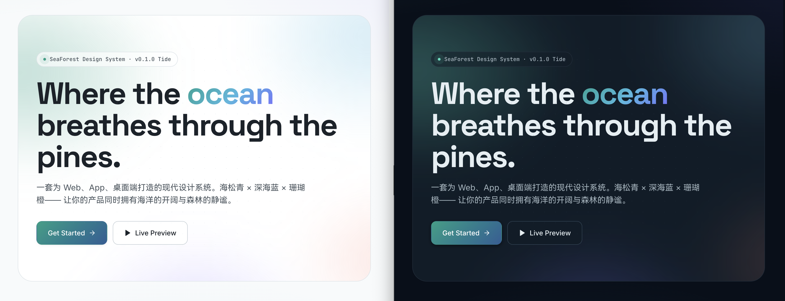

# 🌊🌲 SeaForest Design System

> 海松青、晨雾蓝、珊瑚橙 — 一套为现代 Web / App / 桌面端打造的、有呼吸感的设计系统。

SeaForest 的灵感来自**清晨海岸边的松林**：海雾带着微咸，阳光透过针叶洒下青绿与金色的光斑。它融合了**海洋的开阔**与**森林的静谧**，既简约大气，又活泼现代。

*👆 点击图片进入在线预览 (Live Preview)*

---

## ✨ 特色

- 🎨 **海松青主色** — 不是老气的森林绿，而是介于海与林之间的 Teal，年轻、耐看、跨场景通用
- 🌅 **极光渐变 + 玻璃拟态** — 自带光源的现代视感
- 🪸 **珊瑚橙强调色** — 克制使用，点亮全局 CTA
- 🌓 **浅色 / 深色双主题** — 自动跟随系统，亦可手动切换
- 📐 **完整 Token 体系** — 颜色、字号、间距、圆角、阴影、动效曲线一应俱全
- 🔤 **跨端统一字体** — HarmonyOS Sans SC / Inter / JetBrains Mono
- 📦 **零依赖** — 纯 HTML + CSS 变量，直接 Ctrl+C / Ctrl+V 即可落地

---

## � 阅读顺序建议

1. 打开 [在线预览 (Live Preview)](https://hailin545.github.io/seaforest-ui/preview.html) 感受整体氛围与组件形态
2. 翻阅 [`design.md`](./design.md) 查阅具体规范与 Token 定义
3. 复制所需的 CSS 变量到你自己的项目中使用

---

## 🏷️ 版本

**v0.1.0 · Tide** — 首个公开版本。海松青主色、珊瑚橙强调、极光渐变、玻璃拟态、现代的字号节奏。

---

## 📄 License

MIT © SeaForest

> _Where the ocean breathes through the pines._
